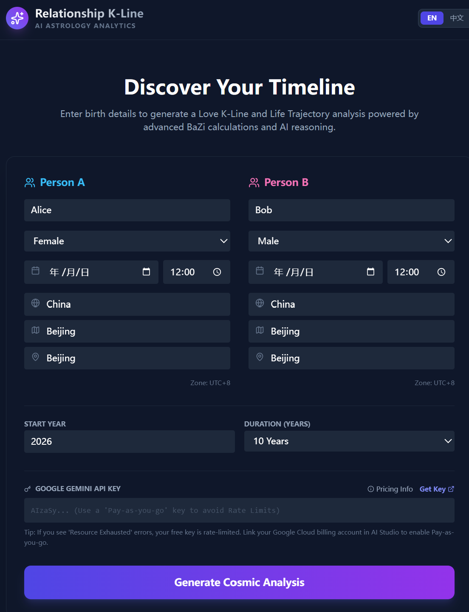

# Relationship K-Line (姻缘 K 线图)

**Relationship K-Line** is an AI-powered astrology visualization tool. It combines traditional Chinese metaphysics (**BaZi / Four Pillars of Destiny**) with modern **Generative AI (Google Gemini)** to quantify and visualize romantic compatibility over time.

Instead of vague horoscopes, this application generates a stock-market-style **"K-Line" (Candlestick Chart)** representing the volatility, trends, and "price action" of a relationship over a 10-20 year period.



## 🚀 Features

*   **Dual-Language Support**: Fully localized for **English** and **Simplified Chinese**. Auto-detects browser language.
*   **Precision Astrology**:
    *   Calculates **True Solar Time** based on longitude/latitude (City/Region/Country selection) for accurate Hour Pillar calculation.
    *   Uses `lunar-javascript` for precise Solar Terms (JieQi) and GanZhi conversions.
*   **AI Reasoning Engine**:
    *   Uses **Google Gemini Pro** models to interpret complex interactions (Clashes, Combinations, Ten Gods).
    *   Generates detailed year-by-year analysis, identifying "Golden Years" and "Risk Years".
*   **Visual Analytics**:
    *   **Love K-Line**: Visualizes relationship intimacy, volatility, and trend direction.
    *   **Dual Life Lines**: Compares individual luck cycles to see if two people are "in sync" or drifting apart.
    *   **Radar Charts**: Break down compatibility into dimensions (Communication, Values, Intimacy, Wealth, etc.).

## 🛠 Tech Stack

### Frontend Core
*   **React 19**: Utilizing the latest React features and Hooks.
*   **TypeScript**: For strict type safety and better developer experience.
*   **Vite**: Next-generation frontend tooling for fast HMR and building.

### UI & Visualization
*   **Tailwind CSS**: Utility-first CSS framework for a responsive, "Space/Dark Mode" aesthetic.
*   **Recharts**: Composable charting library used for the custom Candlestick and Line charts.
*   **Lucide React**: Beautiful, consistent icons.

### Logic & Data
*   **@google/genai**: Official SDK for interacting with Google's Gemini models.
*   **lunar-javascript**: High-precision library for Chinese Lunar Calendar and BaZi calculations.
*   **Context API**: Used for global Language/Localization state management.

## 📦 Installation

1.  **Clone the repository**
    ```bash
    git clone https://github.com/maxzhangg/relationship-k-line.git
    cd relationship-k-line
    ```

2.  **Install Dependencies**
    ```bash
    npm install
    ```

3.  **Run Development Server**
    ```bash
    npm run dev
    ```
    Open `http://localhost:5173` in your browser.

## 🔑 Configuration (API Key)

This application is **Client-Side Only**. It does not have a backend server.
To generate analysis, you must provide a **Google Gemini API Key** in the application interface.

1.  Get a key from [Google AI Studio](https://aistudio.google.com/app/apikey).
2.  Paste it into the "Google Gemini API Key" field on the home screen.
3.  The key is stored locally in your browser's `localStorage` for convenience.

## 🚀 Deployment

The project is configured to deploy easily to **GitHub Pages**.

1.  **Update `vite.config.ts`**:
    Ensure the `base` property matches your repository name:
    ```typescript
    base: '/relationship-k-line/', // Replace with your repo name
    ```

2.  **Build and Deploy**:
    ```bash
    npm run deploy
    ```
    This script runs `tsc && vite build` and then uses `gh-pages` to publish the `dist` folder to the `gh-pages` branch.

## 📄 License

MIT License. Free for personal and educational use.
